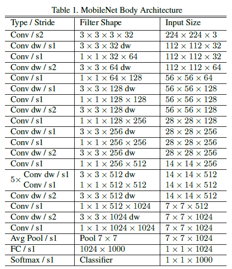
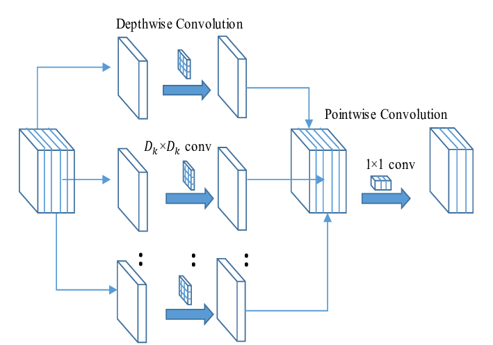
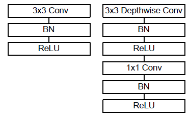

# MobilenetV1
My project is using the TensorFlow framework to implement the [MobilenetV1 model](https://arxiv.org/abs/1704.04861) to classify flower photos. Give me a star if you like this repo.

### Model Architecture
The MobileNet network architecture is shown below. The image below is excerpted from the author's original article
<p align = "center"> 

</p>
We see that the model has 30 layers with following characteristics:
<ul>
    <li><p>Layer 1: Convolution layer with stride size 2</p></li>
    <li><p>Layer 2: Depthwise layer </p></li>
    <li><p>Layer 3: Pointwise layer</p></li>
    <li><p>Layer 4: Depthwise layer with stride size 2 (different from layer 2, layer 2 dw has stride size 1</p></li>
    <li><p>Layer 5: Pointwise layer</p></li>
    <li><p>Layer 30: Softmax, used for classification</p></li>
</ul>

### Depthwise Separable Concolution
<p>The improvement point of the model is to use a convolution method called <code>Depthwise Separable Convolution</code> to reduce the model size and reduce the computational complexity.</p>
<p><code>Depthwise separable convolution </code> is a <code>depthwise convolution</code> followed by a <code>pointwise convolution</code> as follows:</p>
<p align = "center"> 
 </p>
<p>A small note about the architecture here, is that after each convolution MobileNet will use Batch Normalization (BN) and ReLU as shown below:
</p>
<p align = "center"> </p>
<p align = "center"><strong>Standard Convolution on the left, Depthwise separable convolution with BN and ReLU on the right
</strong></p>

### Author
<ul>
    <li>Github: <a href = "https://github.com/Nguyendat-bit">Nguyendat-bit</a> </li>
    <li>Email: <a href = "nduc0231@gmai.com">nduc0231@gmail</a></li>
    <li>Facebook: <a href = "https://www.facebook.com/dat.ng48/">Nguyễn Đạt</a></li>
    <li>Linkedin: <a href = "https://www.linkedin.com/in/nguyendat4801">Đạt Nguyễn Tiến</a></li>
</ul>

## I.  Set up environment
- Step 1: Make sure you have installed Miniconda. If not yet, see the setup document <a href="https://docs.conda.io/en/latest/miniconda.html">here</a>


- Step 2: `cd` into `MobilenetV1` and use command line
```
conda env create -f environment.yml
```

- Step 3: Run conda environment using the command

```
conda activate MobilenetV1
``` 

## II.  Set up your dataset

<!-- - Guide user how to download your data and set the data pipeline  -->
1. Download the data:
- Download dataset [here](http://download.tensorflow.org/example_images/flower_photos.tgz)
2. Extract file and put folder ```train``` and ```validation``` to ```./data``` by using [splitfolders](https://pypi.org/project/split-folders/)
- train folder was used for the training process
- validation folder was used for validating training result after each epoch

This library use ImageDataGenerator API from Tensorflow 2.0 to load images. Make sure you have some understanding of how it works via [its document](https://keras.io/api/preprocessing/image/)
Structure of these folders in ```./data```

```
train/
...daisy/
......daisy0.jpg
......daisy1.jpg
...dandelion/
......dandelion0.jpg
......dandelion1.jpg
...roses/
......roses0.jpg
......roses1.jpg
...sunfloers/
......sunfloers0.jpg
......sunfloers1.jpg
...tulips/
......tulips0.jpg
......tulips1.jpg
```

```
validation/
...daisy/
......daisy2000.jpg
......daisy2001.jpg
...dandelion/
......dandelion2000.jpg
......dandelion2001.jpg
...roses/
......roses2000.jpg
......roses2001.jpg
...sunfloers/
......sunfloers2000.jpg
......sunfloers2001.jpg
...tulips/
......tulips2000.jpg
......tulips2001.jpg
```

## III. Train your model by running this command line

Review training on colab:

<a href="https://colab.research.google.com/drive/1cfmFnrkEs4wwHN6ReMd1adRjjhmsbIZ-?usp=sharing"> </a>


Training script:


```python

python train.py --train-folder ${link_to_train_folder} --valid-folder ${link_to_valid_folder} --classes ${num_classes} --epochs ${epochs}

```


Example:

```python

python train.py  --train-folder ./data/train --valid-folder ./data/val --num-classes 5 --epochs 100 

``` 

There are some important arguments for the script you should consider when running it:

- `train-folder`: The folder of training data
- `valid-folder`: The folder of validation data
- `Mobilenetv1-folder`: Where the model after training saved
- `classes`: The number of your problem classes.
- `batch-size`: The batch size of the dataset
- `lr`: The learning rate
- `droppout`: The droppout 
- `label-smoothing`: The label smoothing
- `image-size`: The image size of the dataset
- `alpha`: Width Multiplier. It was mentioned in the paper on [page 4](https://arxiv.org/pdf/1704.04861.pdf)
- `rho`: Resolution Multiplier, It was mentioned in the paper on [page 4](https://arxiv.org/pdf/1704.04861.pdf)
## IV. Predict Process
If you want to test your single image, please run this code:
```bash
python predict.py --test-file ${link_to_test_image}
```


## V. Result and Comparision


My implementation
```
Epoch 00097: val_acc improved from 0.87534 to 0.87805, saving model to MobilenetV1
Epoch 98/100
207/207 [==============================] - 46s 220ms/step - loss: 0.2158 - acc: 0.9421 - val_loss: 0.4410 - val_acc: 0.8862

Epoch 00098: val_acc improved from 0.87805 to 0.88618, saving model to MobilenetV1
Epoch 99/100
207/207 [==============================] - 45s 217ms/step - loss: 0.1981 - acc: 0.9488 - val_loss: 0.4763 - val_acc: 0.8753

Epoch 00099: val_acc did not improve from 0.88618
Epoch 100/100
207/207 [==============================] - 45s 218ms/step - loss: 0.2038 - acc: 0.9470 - val_loss: 0.4322 - val_acc: 0.8726
```

<!-- **FIXME**

Other architecture

```
Epoch 6/10
391/391 [==============================] - 115s 292ms/step - loss: 0.1999 - acc: 0.9277 - val_loss: 0.4719 - val_acc: 0.8130
Epoch 7/10
391/391 [==============================] - 114s 291ms/step - loss: 0.1526 - acc: 0.9494 - val_loss: 0.5224 - val_acc: 0.8318
Epoch 8/10
391/391 [==============================] - 115s 293ms/step - loss: 0.1441 - acc: 0.9513 - val_loss: 0.5811 - val_acc: 0.7875
``` -->


<!-- ## VI. Running Test

When you want to modify the model, you need to run the test to make sure your change does not affect the whole system.

In the `./folder-name` **(FIXME)** folder please run:

```bash
pytest
``` -->
## VI. Feedback
If you meet any issues when using this library, please let us know via the issues submission tab.


